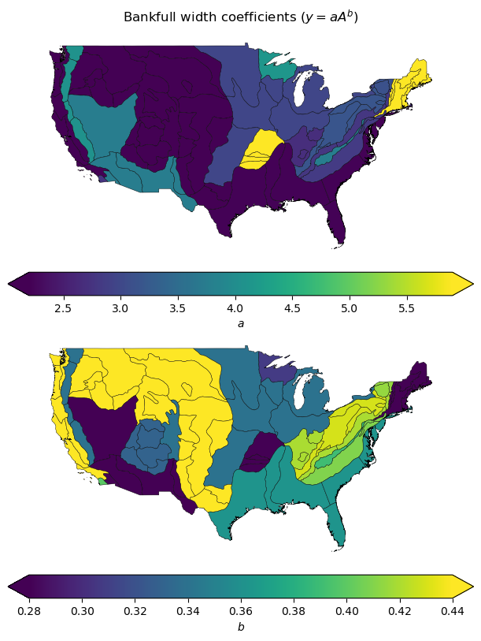

# Bankfull Regression Equations for CONUS

The dataset generated by the methodology presented in this repository can
be directly downloaded from this repository (`bankfull_physio.parquet`) or
[HydroShare](https://www.hydroshare.org/resource/5d3ab5cc521344c881c38621fa3769f1/)
using
[this link](https://www.hydroshare.org/resource/5d3ab5cc521344c881c38621fa3769f1/data/contents/bankfull_phyiso.parquet).

## Motivation

For hydrological and hydraulic modeling, the bankfull width and depth are
important parameters that are challenging to measure in the field and/or
estimate a priori. Many studies suggested different methodologies for estimating
these parameters based on various geomorphological and hydrological characteristics.
One such study is by [Bieger et al. (2015)](https://doi.org/10.1111/jawr.12282)
which proposed a methodology to estimate bankfull width and depth for the conterminous
United States (CONUS) using regression equations. They gathered hydraulic geometry
data from hundreds of sites across the CONUS and developed regional regression
equations for the
[Physiographic Regions of CONUS](https://www.sciencebase.gov/catalog/item/631405bbd34e36012efa304e).
The general form of the regression equations is:

$$
Y = a \times A^b,
$$

where `Y` is the bankfull width or depth, `A` is the drainage area, and `a` and `b`
are the coefficients of the regression equation. The coefficients `a` and `b` are
specific to each physiographic region. Thus, bankfull width and depth can be
estimated for any location in the CONUS using the drainage area and the coefficients
of the corresponding physiographic region.

However, the dataset provided by Bieger et al. (2015) is not readily available
for use in hydrological and hydraulic modeling. This repository aims to provide
a methodology to generate a geospatial dataset for the bankfull width and depth
of the CONUS using the regression equations provided by Bieger et al. (2015).
So, users can easily query the bankfull width and depth for any location in the
CONUS using the drainage area and the coefficients of the corresponding physiographic.

## Methodology

You can run `bankfull_physio.py` to reproduce the dataset. The script depends on
`pandas`, `geopandas`, `pyogrio`, and `openpyxl` packages that can be installed
with `pip` or `mamba`:

```bash
pip install pandas geopandas pyogrio openpyxl
```

or

```bash
mamba install pandas geopandas-base pyogrio openpyxl
```

Here is a brief overview of the methodology to generate the bankfull width
and depth dataset:

1. From the supplementary material of Bieger et al. (2015), which is a Microsoft
   Word file, convert SUPPLEMENTARY TABLE 1 to an Excel file. Save the results
   to `bankfull_equations.xlsx`.
1. Extract the coefficients of the regression equations for each physiographic
   region.
1. Download the Physiographic Regions of CONUS shapefile from the
   [ScienceBase](https://www.sciencebase.gov/catalog/item/631405bbd34e36012efa304e).
1. Ensure the keywords for the regions in the shapefile match the keywords in the
   Excel file.
1. Use the shapefile and the coefficients to generate the bankfull width and depth
    dataset for the CONUS.
1. Save the dataset to a GeoParquet file.


